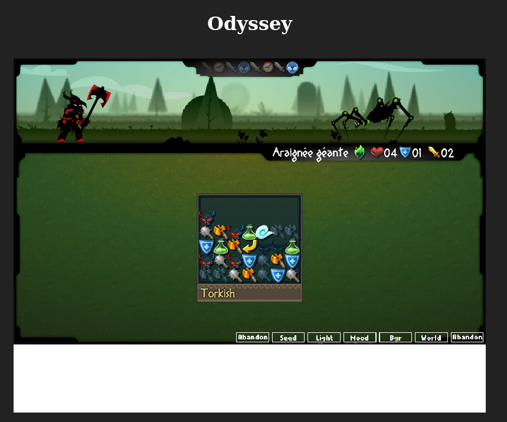

# Odyssey Demo



You need [Python 3.13](https://www.python.org/downloads/) to run this demo.

## Install dependencies

```bash
python -m .venv venv
source venv/bin/activate
pip install -r requirements.txt
```

## Run the server

```bash
fastapi run
```

# Licence 

This repository is licensed under the [CC BY-NC-SA 4.0](https://creativecommons.org/licenses/by-nc-sa/4.0/) license.